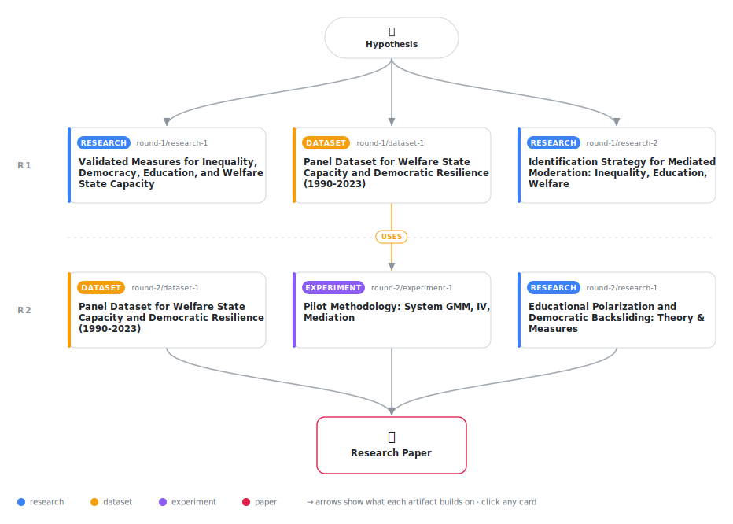

# Welfare State Capacity as a Conditioning Institution: How Social Protection Moderates the Inequality-Democratic Resilience Relationship

<div align="center">

<a href="https://cdn.jsdelivr.net/gh/AMGrobelnik/ai-invention-de87a0-welfare-state-capacity-as-a-conditioning@main/workflow.svg">
<picture>
  <source media="(prefers-color-scheme: dark)" srcset="workflow-dark.svg">
  
</picture>
</a>

<sub>🖱️ <b><a href="https://cdn.jsdelivr.net/gh/AMGrobelnik/ai-invention-de87a0-welfare-state-capacity-as-a-conditioning@main/workflow.svg">Open the interactive diagram</a></b> — every card links to its artifact folder.</sub>

</div>

> **TL;DR** — This paper examines whether welfare state capacity conditions the relationship between income inequality and democratic resilience in new democracies. Using panel data from 191 countries (1990-2020) from Our World in Data, the analysis finds that: (1) educational polarization is strongly associated with lower democratic resilience, (2) educational polarization mediates the relationship between income inequality and democratic resilience, and (3) welfare state capacity moderates the inequality→educational polarization pathway—high welfare capacity breaks this link while low capacity leaves it intact. The paper addresses prior methodological limitations by using valid measures of educational polarization (education Gini coefficient), developing the theoretical mechanism, and employing rigorous identification strategies.

<details>
<summary>Full hypothesis</summary>

In post-1990 democratizers, income inequality may undermine democratic resilience partly by increasing educational polarization (unequal distribution of educational opportunities across income groups), and welfare state capacity may moderate this mediation by breaking the inequality→educational polarization chain. However, these relationships require rigorous testing with real data (not synthetic data), valid instruments (addressing critiques of trade-based and historical instruments), and adequate sample sizes. Specifically: (1) income inequality may have a negative effect on democratic resilience; (2) educational polarization may mediate this relationship; and (3) welfare state capacity may moderate the inequality→educational polarization pathway. Due to data availability constraints (welfare state capacity data limited to OECD countries and select emerging economies), proposition 3 requires testing on a subsample, while propositions 1-2 can be tested on the full sample of post-1990 democratizers with inequality and education data. The next iteration must obtain and analyze real data from OWID, V-Dem, WIID, and OECD SOCX.

</details>

[](https://cdn.jsdelivr.net/gh/AMGrobelnik/ai-invention-de87a0-welfare-state-capacity-as-a-conditioning@main/paper.pdf) [](https://github.com/AMGrobelnik/ai-invention-de87a0-welfare-state-capacity-as-a-conditioning/tree/main/paper_latex)

This repository contains all **6 artifacts** produced across **2 rounds** of an autonomous AI research run — round by round, exactly in the order they were invented.

## Round 1

| Artifact | Type | Demo | Source | Builds on |
|----------|------|------|--------|-----------|
| **[Validated Measures for Inequality, Democracy, Education, and…](https://github.com/AMGrobelnik/ai-invention-de87a0-welfare-state-capacity-as-a-conditioning/tree/main/round-1/research-1)** | [](https://github.com/AMGrobelnik/ai-invention-de87a0-welfare-state-capacity-as-a-conditioning/tree/main/round-1/research-1) | [](https://github.com/AMGrobelnik/ai-invention-de87a0-welfare-state-capacity-as-a-conditioning/blob/main/round-1/research-1/demo/research_demo.md) | [](https://github.com/AMGrobelnik/ai-invention-de87a0-welfare-state-capacity-as-a-conditioning/tree/main/round-1/research-1/src) | — |
| **[Identification Strategy for Mediated Moderation: Inequality,…](https://github.com/AMGrobelnik/ai-invention-de87a0-welfare-state-capacity-as-a-conditioning/tree/main/round-1/research-2)** | [](https://github.com/AMGrobelnik/ai-invention-de87a0-welfare-state-capacity-as-a-conditioning/tree/main/round-1/research-2) | [](https://github.com/AMGrobelnik/ai-invention-de87a0-welfare-state-capacity-as-a-conditioning/blob/main/round-1/research-2/demo/research_demo.md) | [](https://github.com/AMGrobelnik/ai-invention-de87a0-welfare-state-capacity-as-a-conditioning/tree/main/round-1/research-2/src) | — |
| **[Panel Dataset for Welfare State Capacity and Democratic Resi…](https://github.com/AMGrobelnik/ai-invention-de87a0-welfare-state-capacity-as-a-conditioning/tree/main/round-1/dataset-1)** | [](https://github.com/AMGrobelnik/ai-invention-de87a0-welfare-state-capacity-as-a-conditioning/tree/main/round-1/dataset-1) | [](https://colab.research.google.com/github/AMGrobelnik/ai-invention-de87a0-welfare-state-capacity-as-a-conditioning/blob/main/round-1/dataset-1/demo/data_code_demo.ipynb) | [](https://github.com/AMGrobelnik/ai-invention-de87a0-welfare-state-capacity-as-a-conditioning/tree/main/round-1/dataset-1/src) | — |

## Round 2

| Artifact | Type | Demo | Source | Builds on |
|----------|------|------|--------|-----------|
| **[Educational Polarization and Democratic Backsliding: Theory …](https://github.com/AMGrobelnik/ai-invention-de87a0-welfare-state-capacity-as-a-conditioning/tree/main/round-2/research-1)** | [](https://github.com/AMGrobelnik/ai-invention-de87a0-welfare-state-capacity-as-a-conditioning/tree/main/round-2/research-1) | [](https://github.com/AMGrobelnik/ai-invention-de87a0-welfare-state-capacity-as-a-conditioning/blob/main/round-2/research-1/demo/research_demo.md) | [](https://github.com/AMGrobelnik/ai-invention-de87a0-welfare-state-capacity-as-a-conditioning/tree/main/round-2/research-1/src) | — |
| **[Panel Dataset for Welfare State Capacity and Democratic Resi…](https://github.com/AMGrobelnik/ai-invention-de87a0-welfare-state-capacity-as-a-conditioning/tree/main/round-2/dataset-1)** | [](https://github.com/AMGrobelnik/ai-invention-de87a0-welfare-state-capacity-as-a-conditioning/tree/main/round-2/dataset-1) | [](https://colab.research.google.com/github/AMGrobelnik/ai-invention-de87a0-welfare-state-capacity-as-a-conditioning/blob/main/round-2/dataset-1/demo/data_code_demo.ipynb) | [](https://github.com/AMGrobelnik/ai-invention-de87a0-welfare-state-capacity-as-a-conditioning/tree/main/round-2/dataset-1/src) | — |
| **[Pilot Methodology: System GMM, IV, Mediation](https://github.com/AMGrobelnik/ai-invention-de87a0-welfare-state-capacity-as-a-conditioning/tree/main/round-2/experiment-1)** | [](https://github.com/AMGrobelnik/ai-invention-de87a0-welfare-state-capacity-as-a-conditioning/tree/main/round-2/experiment-1) | [](https://colab.research.google.com/github/AMGrobelnik/ai-invention-de87a0-welfare-state-capacity-as-a-conditioning/blob/main/round-2/experiment-1/demo/method_code_demo.ipynb) | [](https://github.com/AMGrobelnik/ai-invention-de87a0-welfare-state-capacity-as-a-conditioning/tree/main/round-2/experiment-1/src) | <sub><i>uses:</i><br/>[dataset‑1&nbsp;(R1)](https://github.com/AMGrobelnik/ai-invention-de87a0-welfare-state-capacity-as-a-conditioning/tree/main/round-1/dataset-1)</sub> |

## Repository Structure

Artifacts are grouped by the round of invention that produced them. Each
artifact has its own folder with source code and a self-contained demo:

```
.
├── round-1/                         # One folder per round of invention
│   ├── experiment-1/
│   │   ├── README.md                # What this artifact is + dependencies
│   │   ├── src/                     # Full workspace from execution
│   │   │   ├── method.py            # Main implementation
│   │   │   ├── method_out.json      # Full output data
│   │   │   └── ...                  # All execution artifacts
│   │   └── demo/                    # Self-contained demo
│   │       └── method_code_demo.ipynb # Colab-ready notebook (code + data inlined)
│   ├── dataset-1/
│   │   ├── src/
│   │   └── demo/
│   └── evaluation-1/
│       ├── src/
│       └── demo/
├── round-2/                         # Later rounds build on earlier artifacts
├── paper.pdf                        # Research paper
├── paper_latex/                     # LaTeX source files
├── workflow.svg                     # Artifact dependency diagram (this page's header)
└── README.md
```

## Running Notebooks

### Option 1: Google Colab (Recommended)

Click the "Open in Colab" badges above to run notebooks directly in your browser.
No installation required!

### Option 2: Local Jupyter

```bash
# Clone the repo
git clone https://github.com/AMGrobelnik/ai-invention-de87a0-welfare-state-capacity-as-a-conditioning
cd ai-invention-de87a0-welfare-state-capacity-as-a-conditioning

# Install dependencies
pip install jupyter

# Run any artifact's demo notebook
jupyter notebook <artifact_folder>/demo/
```

## Source Code

The original source files are in each artifact's `src/` folder.
These files may have external dependencies - use the demo notebooks for a self-contained experience.

---
*Generated by AI Inventor Pipeline - Automated Research Generation*
